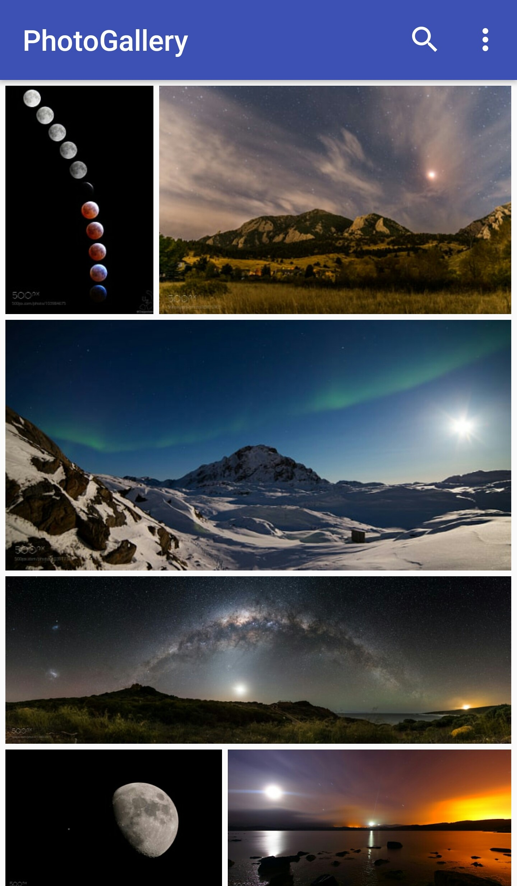
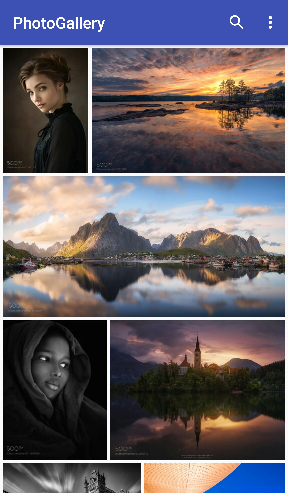
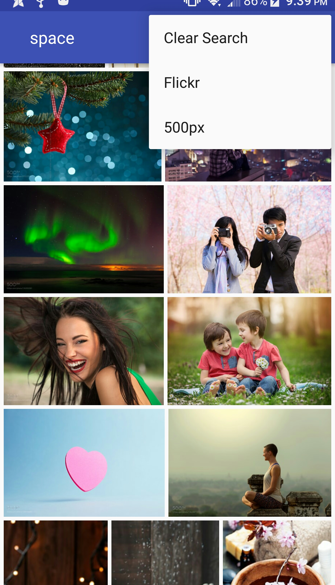

# MultiGallery
A Photo Gallery for Android. Currently works with 500px and Flickr.

If you want to build this app, you must first obtain your own API keys from 500px and Flickr.

## Features
+ Searching
+ Saving Preferences
+ Dynamic Sizing for RecyclerView
+ Works with both Flickr and 500px

## Libraries
- **Picasso**

Image Loading and caching.

- **GreedoLayout**

To preserve ratio of photos in the RecyclerView

- **MeasUtils by Julian Villella** 
 
 

 </img>  </img>

 </img>  </img>
